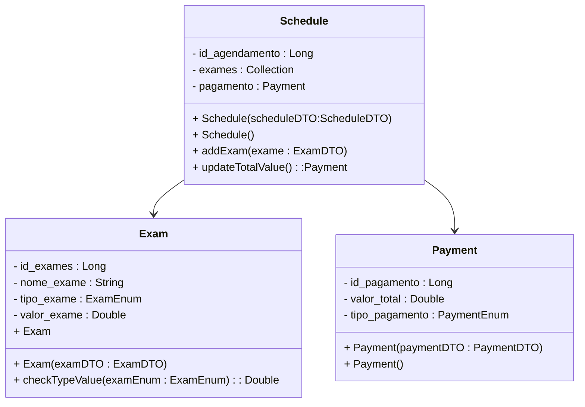

The stack in this API is:
Java 17 LTS with Spring
Gradle
Docker
OpenAPI (Swagger)
Azure Container Registry to upload the docker image

To access the API i've used:
Azure App Service

```mermaid
classDiagram
    class Schedule{
        - id_agendamento : Long
        - exames : Collection
        - pagamento : Payment
        + Schedule(scheduleDTO:ScheduleDTO)
        + Schedule()
        + addExam(exame : ExamDTO)
        + updateTotalValue():Payment
    }
    class Exam{
        - id_exames : Long
        - nome_exame : String
        - tipo_exame : ExamEnum
        - valor_exame : Double
        + Exam(examDTO : ExamDTO)
        + Exam
        + checkTypeValue(examEnum : ExamEnum) : Double
    }
    class Payment{
        - id_pagamento : Long
        - valor_total : Double
        - tipo_pagamento : PaymentEnum
        + Payment(paymentDTO : PaymentDTO)
        + Payment()
    }
    Schedule --> Exam
    Schedule --> Payment
```
